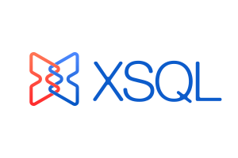

[English](https://github.com/Qihoo360/XSQL/blob/master/README.md) | [中文](https://github.com/Qihoo360/XSQL/blob/master/README-CN.md)

XSQL is a multi-datasource query engine which designed easy to use, stable to run.1）First of all, XSQL provides a solution to read data from NoSQL database  with standard SQL，so that big data engineer can concentrate on data but API with special data source . 2）XSQL takes some efforts of optimizing the execute plan of SQL execution as well as monitoring the running status of every SQL, which make user's job running healthier.

[http://xsql.qihoo.net](http://xsql.qihoo.net/)

## Features

- XSQL supports eight built-in data source for now (e.g. Hive, Mysql, EleasticSearch, Mongo, Kafka, Hbase, Redis, Druid).
- XSQL designs a `3-layer metadata architecture` to organize data, which is datasource-database-table. So , we can provide a unified view of many data sources and no longer difficult to make a business analytical between off-line data and on-line data .
- The main idea of XSQL are `SQL Everything` , SQL let program decoupling with concrete data source API , therefore DBA can upgrade data but need to taking into consideration how to migrating old tasks . More importantly, data analysts prefer SQL rather than special APIs.
- XSQL only takes use of YARN cluster resources when necessary, this feature is useful for some usage scenario such as user treated spark-xsql as substitution of RDMS Client. We call this `Pushdown Query`, it makes XSQL get the ability to response DDL and Simple Query in ms delay level, as well as saving cluster resources as much as possible.
- XSQL uses a different solution than routing , So it only parses SQL once.
- XSQL caches metadata in runtime but don't manage metadata itself，in consideration of metadata synchronize may cause unnecessary trouble. This feature makes XSQL easy to deploy and ops.
- XSQL provides a white-blacklist properties file to cover special usage scenario metadata should be carefully authorized.
- XSQL can run on spark2.3 and spark2.4 for now. Jars of XSQL placed in isolated directory, which means XSQL won't take effect on your existed spark program unless you use our tool `bin/spark-xsql`. So, just try XSQL on your existed spark distribution, All things will work fine as normal.

## Quick Start

**Environment Requirements of Build**

- jdk 1.8+

### Build XSQL:

1. To get started with XSQL, you can build it by yourself. For example,

   ```
   git clone https://github.com/Qihoo360/XSQL
   ```

   You can also get pre-built XSQL from [Release Pages](https://github.com/shadowsocks/shadowsocks-android/releases) .

2. When you want to create a XSQL distribution of source code, which is similar to the release package in the [Release Pages](https://github.com/shadowsocks/shadowsocks-android/releases) , use `build-plugin.sh` in the root directory of project. For example:

   ```
   XSQL/build-plugin.sh
   ```

   This will produce a .tgz file named like `xsql-[project.version]-plugin-spark-[spark.version].tgz` in the root directory of project.

   To create a XSQL distribution like natural Spark distribution, use `build.sh` in the root directory of project. For example:

   ```
   XSQL/build.sh
   ```

   This will produce a .tgz file named like `xsql-[project.version]-bin-spark-[spark.version].tgz` in the root directory of project.

**Environment Requirements of Running**

- jdk 1.8+

- hadoop 2.7.2+

- spark 2.4.x

### Installing XSQL:

1. Build the XSQL tar  `xsql-[project.version]-[plugin|bin]-spark-[spark.version].tgz` following the above steps or Download from  [Release Pages](https://github.com/shadowsocks/shadowsocks-android/releases).

2. If you have installed spark in your machine, please use the `plugin` version which size is 30M+.  Or you need to install the `bin` version, which is about 300M + in size, which is far more than the `plugin` version.

   For either `plugin` version or `bin` version, both need to be extracted into your software directory at first. For example:

   ```shell
   tar xvf xsql-0.6.0-bin-spark-2.4.3.tgz -C "/path/of/software"
   ```

   The destination directory of `plugin` version is different to `bin` version：

   ```shell
   tar xvf xsql-0.6.0-plugin-spark-2.4.3.tgz -C "/path/of/sparkhome"
   ```

3. XSQL needs to know the information (like url and authorization ) of each data source .You can configure them in `xsql.conf` under `conf` directory. We provided a template file to help user configuring XSQL. For example:

   ```
   mv conf/xsql.conf.template xsql.conf
   ```
   There is an example of `MySQL` configuration:

   ```
   spark.xsql.datasources                     default
   spark.xsql.default.database                real_database
   spark.xsql.datasource.default.type         mysql
   spark.xsql.datasource.default.url          jdbc:mysql://127.0.0.1:2336
   spark.xsql.datasource.default.user         real_username
   spark.xsql.datasource.default.password     real_password
   spark.xsql.datasource.default.version      5.6.19
   ```

### Running XSQL:

1. If you are familiar with `spark-sql` , we provide an improved bash tool `bin/spark-xsql`. XSQL can be started in Cli mode by following command:

   ```shell
   $SPARK_HOME/bin/spark-xsql
   ```

   Feel free to input any SQL/HiveSQL in the prompt line:

   ```
   spark-xsql> show datasources;
   ```

2. If you are familiar with DataSet API, start from our scala api is a good choice. For example:

   ```scala
   var spark = SparkSession
     .builder()
     .enableXSQLSupport()
     .getOrCreate()
   spark.sql("show datasources")
   ```


## FAQ

[Connect to more datasource](http://xsql.qihoo.net/datasources/common/)

[Advanced Configuration](http://xsql.qihoo.net/tutorial/configuration/)

[XSQL Specific Query Language](http://xsql.qihoo.net/tutorial/syntax/)

## Contact Us

Mail Lists: For developers `xsql_dev@groups.163.com`, For users `xsql_user@groups.163.com`. Add yours by emailing it.

QQ Group for Chinese user : No.838910008
